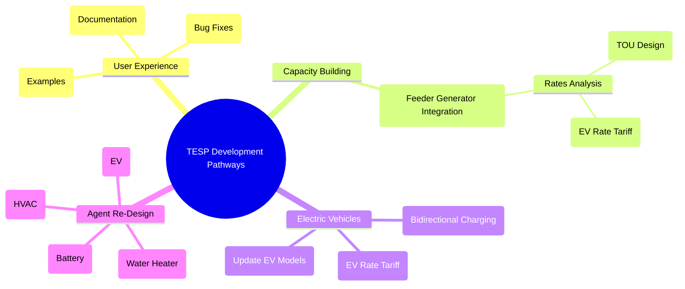
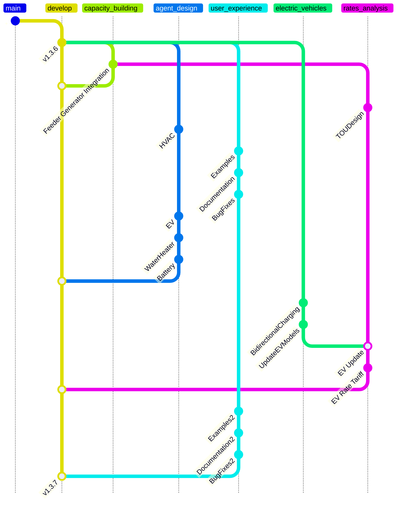

# TESP Development Pathways

## MindMap Style

```mermaid
mindmap
  root((TESP Development Pathways))
    User Experience
      (Examples)
      (Documentation)
      (Bug Fixes)
    Capacity Building
        (Feeder Generator Integration)
            Rates Analysis
                (TOU Design)
                (EV Rate Tariff)
    Electric Vehicles
        (Bidirectional Charging)
        (EV Rate Tariff)
        (Update EV Models)
    Agent Re-Design
        (HVAC)
        (EV)
        (Water Heater)
        (Battery)
```

## GitGraph Style

```mermaid
%%{init: { 'logLevel': 'debug',  'gitGraph': {'rotateCommitLabel': 'false'}, 'themeVariables': {'commitLabelFontSize': '16px'}} }%%
gitGraph TB:
    commit id: " "
    branch develop
    commit id: "v1.3.6"
    branch capacity_building
    branch agent_design
    branch user_experience
    branch electric_vehicles
    checkout capacity_building
        commit id: "Feeder Generator Integration"
        branch rates_analysis
        checkout develop
        merge capacity_building
        checkout rates_analysis
            commit id: "TOUDesign"
    
    checkout agent_design
        commit id: "HVAC"
    
    
    checkout user_experience
      commit id: "Examples"
      commit id: "Documentation"
      commit id: "BugFixes"
    checkout agent_design
        commit id: "EV"
        commit id: "WaterHeater"
        commit id: "Battery"
    checkout develop
    merge agent_design
    checkout electric_vehicles
      commit id: "BidirectionalCharging"
      commit id: "UpdateEVModels"
    checkout rates_analysis
        
        merge electric_vehicles id: "EV Update"
        commit id: "EV Rate Tariff"
    checkout develop
    merge rates_analysis

    
    checkout user_experience
      commit id: "Examples2"
      commit id: "Documentation2"
      commit id: "BugFixes2"
    checkout develop
    merge user_experience id: "v1.3.7"

```